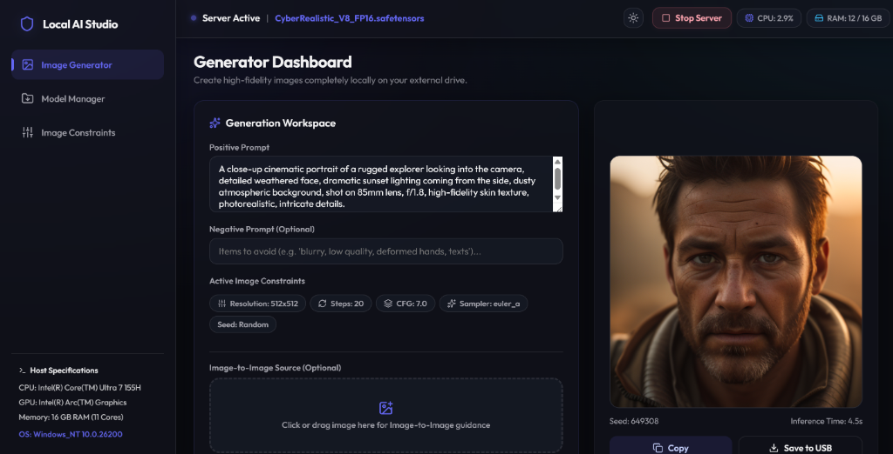
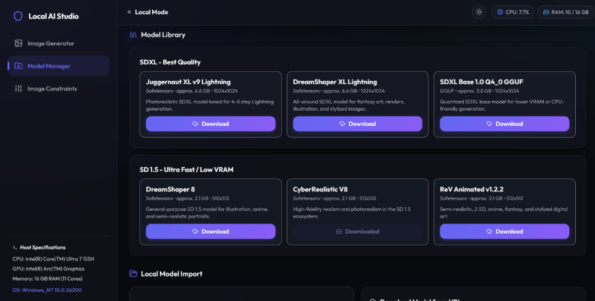
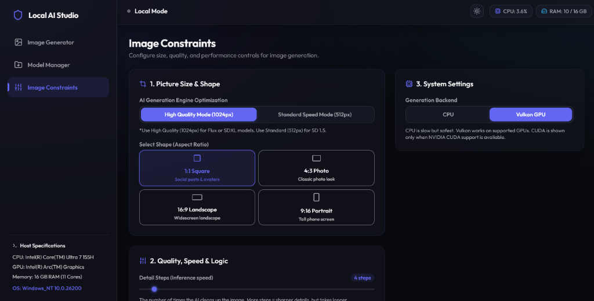
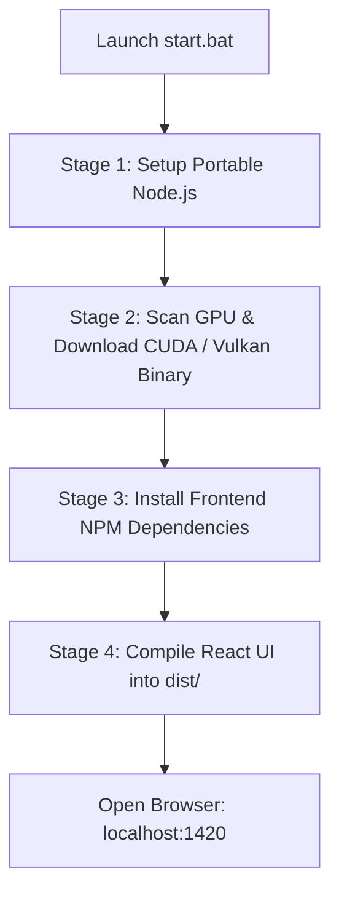

<div align="center">

# 🖼️ Local AI Image Generator

### A fully self-contained, offline-first AI Art Studio for Windows

[](https://github.com)
[](LICENSE)
[](https://github.com)
[](https://github.com/leejet/stable-diffusion.cpp)

---

[🚀 Quick Start](#-quick-start) • [✨ Features](#-features) • [📸 Screenshots](#-screenshots) • [📂 Project Structure](#-project-structure) • [📦 Adding Models](#-adding-models-required) • [🛠️ Troubleshooting](#%EF%B8%8F-troubleshooting)

---



</div>

## 📖 Overview

**Local AI Image Generator** is a packaged, production-grade desktop environment designed to run Stable Diffusion models natively on Windows with maximum performance and zero installation complexity. 

Say goodbye to manual Python installations, corrupted PyTorch dependencies, global Node.js setups, or broken CUDA toolchains. This workspace automatically downloads, configures, and serves the entire local image generation stack inside a single directory.

---

## ⚡ Quick Start

### 1. Launch
Double-click **`start.bat`** in the root directory. 

*On your first launch, the automated installer script will download a portable Node.js build, configure dependencies, detect your GPU, download pre-compiled backend binaries, and compile the user interface.*

### 2. Put Weights in Place
Place any `.safetensors`, `.gguf`, or `.ckpt` model file into:
```
app/models/
```
*(Or use the **Model Manager** tab in the browser dashboard to download one from our curated library).*

### 3. Generate Offline
Open **`http://localhost:1420`** in your default web browser, select your model, write a prompt, and start creating!

---

## ✨ Features

<table>
  <tr>
    <td width="50%">
      <h3>🔒 100% Offline & Private</h3>
      <p>All inference runs entirely on your local GPU/CPU. Your prompts, images, and data never leave your computer.</p>
    </td>
    <td width="50%">
      <h3>🚀 Auto-Detected GPU Acceleration</h3>
      <p>Seamlessly detects and configures **CUDA** for Nvidia cards, or falls back to the high-performance **Vulkan** engine for AMD & Intel Arc GPUs.</p>
    </td>
  </tr>
  <tr>
    <td width="50%">
      <h3>📦 No Global Dependencies</h3>
      <p>Zero system footprint. Node.js is downloaded as a portable binary into a sandbox folder, leaving your environment paths untouched.</p>
    </td>
    <td width="50%">
      <h3>🎛️ Dynamic Backend Controller</h3>
      <p>A native Node.js process manager hosts the React frontend, streams system telemetry, manages downloads, and handles inference server lifecycles.</p>
    </td>
  </tr>
  <tr>
    <td width="50%">
      <h3>📊 Real-time Hardware Telemetry</h3>
      <p>Monitor your PC's real-time CPU, RAM, GPU, and VRAM utilization directly inside the workspace UI.</p>
    </td>
    <td width="50%">
      <h3>📁 Drag & Drop Model Importing</h3>
      <p>Upload local model files from other folders on your PC or download weights directly from Hugging Face via the built-in UI downloader.</p>
    </td>
  </tr>
</table>

---

## 📸 Screenshots

### Model Library Manager
Allows downloading recommended weights or importing custom files directly through the UI.


### Inference & Hardware Constraints
Adjust parameters, resolution aspect-ratios, and hardware backend options in one place.


---

## 🏗️ Project Structure

```
local-ai-image-generator/
├── start.bat                  # main double-click launcher
├── LICENSE                    # MIT Open Source license
├── .gitignore
├── README.md                  
│
├── scripts/
│   ├── setup.ps1              # dynamic 4-stage dependency manager
│   ├── reset.ps1              # repair utility (clears builds, keeps your models/images)
│   └── serve.cjs              # static UI server & backend controller
│
└── app/
    ├── frontend/              # React + Vite dashboard source code
    ├── backend/               # pre-compiled stable-diffusion.cpp GPU binaries
    │   ├── win/cuda/          # CUDA acceleration backend (sd-cuda.exe)
    │   └── win/vulkan/        # Vulkan acceleration backend (sd-vulkan.exe)
    ├── models/                # weight repository (.safetensors, .gguf, .ckpt)
    ├── outputs/               # generated PNGs and JSON parameters metadata
    ├── tools/node/            # portable Node.js sandbox
    └── dist/                  # built frontend assets (compiled on setup)
```

---

## 📦 First-Run Setup Stages

When launching for the first time, `scripts/setup.ps1` runs automatically in your console window through 4 stages:



---

## 📥 Adding Models (Required)

> [!IMPORTANT]
> **This repository does not ship with pre-downloaded AI weights** due to their large file sizes (2 GB to 12 GB+). The `app/models/` folder will be empty on your first start. You must add at least one model before generating.

You can import weights using **three simple options**:

1. **Curated Library:** Navigate to the **Model Manager** tab in the dashboard and click **Download** next to any of our pre-configured models (e.g. *DreamShaper 8* for SD 1.5 speed, or *Juggernaut XL* for SDXL realism).
2. **Download URL:** Paste any direct download link to a GGUF/Safetensors weights file (e.g. from Civitai or Hugging Face) into the Model Manager URL box.
3. **Manual Import:** Move your existing `.safetensors`, `.gguf`, or `.ckpt` weights files directly into the `app/models/` directory.

---

## 🖥️ GPU Compatibility Matrix

The application server configures itself to utilize the best performance pathways on your PC:

| GPU Brand | Tech | Status | Setup Output |
| :--- | :--- | :--- | :--- |
| **Nvidia** | CUDA | ✅ Native Support | Maps `sd-cuda.exe` with Nvidia SDK 12 optimizations. |
| **AMD Radeon** | Vulkan | ✅ Native Support | Maps `sd-vulkan.exe` with Vulkan API acceleration. |
| **Intel Arc** | Vulkan | ✅ Native Support | Maps `sd-vulkan.exe` for GPU acceleration. |
| **None / Integrated** | CPU | ⚠️ Thread Fallback | Runs on logical threads (slow, for testing). |

---

## 🛠️ Troubleshooting

### 🔄 Resetting / Repairing
If you encounter corrupted downloads or want to rebuild your frontend assets, run:
```powershell
scripts/reset.ps1
```
*Note: This cleans the portable environment files and downloads fresh copies, but **safely preserves your downloaded models inside `app/models/` and images in `app/outputs/`**.*

### 🔌 Port Conflict Warnings
The launcher utilizes two ports on local address `127.0.0.1`:
- **`1420`** (Frontend Dashboard Server)
- **`8080`** (Local Inference C++ API Server)

Ensure no other applications or development services are binding to these ports before launching.

---

## 📝 License

This project is licensed under the MIT License - see the [LICENSE](LICENSE) file for details.

It bundles [stable-diffusion.cpp](https://github.com/leejet/stable-diffusion.cpp) which is also licensed under the MIT License. Model weights are subject to their own respective licenses — please check model cards on Hugging Face or Civitai before commercial application.